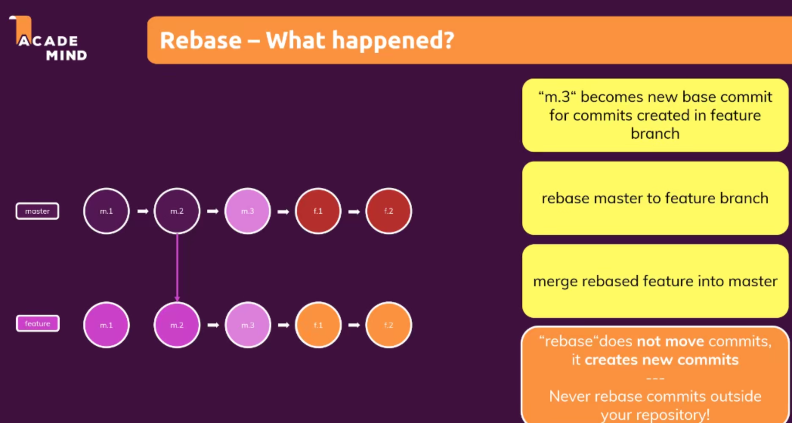

# 4. Dive deeper into git 
## 050 git stash
it can save unsatged and uncommited changes
-git stash: makes your unstaged info disappear
-git stash apply: make them reappear
- git stash push -m 'you can add info here'
- git stash list: shows you all stash you excerted 
- git stash pop index_number:retrieve certain stash and ready to commit;you deleted it from your stash and apply to your project 
- drop/delete certain satsh:git stash drop
- delete the entire satsh: git stash clear
## 051 bring the lost data back with git reflog
- reflog stores all our information of commit
- git reflog: it keeps informtion for 30days
- This restore any deleted commit:
git reset --hard hashnumber(see the img down below)

### restore a branch 
Question: you create a new branch and add a file and stage it. Then you delete the branch 
what do you do if you want to restore this branch?
(1) git checkout hashnumber : you are now in detached head mode
(2) git checkout -b branch 
## 052 combining branches 
## 053 Understand merge types
Fast-forward merge:no additionl commit in master after feature branch was created

## 054 Applying the fastforward merge
git merge --squash feature
with this command, you put all changes in feature branch in one commit
a seperate commit has to be created to contain all these changes
## 055 NON-fastforward merge,the recursive merge
git merge --no-ff feature
when master branch has new commit and master and feature branch has different base, use non-ff merge
## git Rebase
[youtube video about 'rebase and merge'](https://www.youtube.com/watch?v=CRlGDDprdOQ)
switch to the branch and type **git rebase master**
- Logics 

[caution] when woring with other people, use rebase with caution as rebase commits(commit ID number changes)
- when to apply 

 ## merge conflict 
 it occurs when two people trying to work on the same files from different branch
- solution
VSCODE
git merge --abort: go back before the merge 
git log --merge:
git diff 
- 删除本地git仓库
ls -a找到.git文件
rm -rf .git